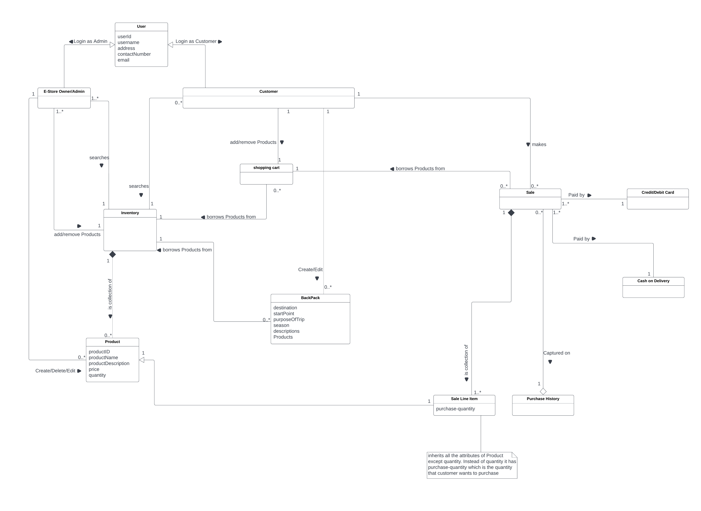

# PROJECT Design Documentation

## Team Information

- Team name: TEAM 1
- Team members
  - Sam Singh Anantha
  - Monoshiz Mahbub Khan
  - Vidit Naithani
  - Regina Afu
  - Utkarsh Sharma

## Executive Summary

Backpack is an e-store that sells outdoor gear and equipment for camping, biking, hiking, fishing trips, and so on. Users can also create a curated list of equipment they used on their trip to a certain destination. Other users can view these lists and add them to their cart, making it easier for them to buy equipment based on their necessity.

## Requirements

This section describes the features of the application.

### Definition of MVP

A minimum viable product is an early iteration of the product that provides a minimum number of essential features a customer can use. Additional features are built on top of the MVP features.

### MVP Features

**User Login**  
The user login feature enables the admin and customer to login so they can see the respective screens.

_Admin login_  
As an admin, I want to login through my username to Backpack so that I can access my dashboard to view orders and inventory.

_Customer login_  
As a customer, I want to login through my username to Backpack so that I can access member-only features.

**Inventory Management**  
The Inventory Management feature provides a dashboard for the admin to keep track of their inventory.

- As an admin, I want to add new equipment to my inventory.
- As an admin, I want to remove equipment from my inventory.
- As an admin, I want to edit details the equipment.
- As an admin, I want to adjust quantities of equipment.

**Product search**  
The Product Search feature lets the customer browse through the catalogue.

- As a customer, I want to see a list of all the equipment in the product catalogue.
- As a customer, I want to search for an equipment in the product catalogue.

**Cart Management**
The cart management feature lets the customer manipulate the cart.

- As a customer, I want to add equipment to my cart.
- As a customer, I want to update the quantity of items in my cart.
- As a customer, I want to delete equipment from my cart
- As a customer, I want my cart data to be preserved, even when I close the tab.

### Roadmap of Enhancements

**Curated Equipment**

- As a customer, I want to create a list of curated equipment.
- As a customer, I want to modify a curated list I created.
- As a customer, I want to delete a curated list I created.
- As a customer, I want to search for curated lists.
- As a customer, I want to add items from a curated list to my cart.

## Application Domain

This section describes the application domain.

## Architecture and Design

### Summary

The following Tiers/Layers model shows a high-level view of the webapp's architecture.

The e-store web application, is built using the Model–View–ViewModel (MVVM) architecture pattern.

The Model stores the application data objects including any functionality to provide persistance.

The View is the client-side SPA built with Angular utilizing HTML, CSS and TypeScript. The ViewModel provides RESTful APIs to the client (View) as well as any logic required to manipulate the data objects from the Model.

Both the ViewModel and Model are built using Java and Spring Framework. Details of the components within these tiers are supplied below.

### Overview of User Interface

This section describes the web interface flow; this is how the user views and interacts
with the e-store application.

> _Provide a summary of the application's user interface. Describe, from
> the user's perspective, the flow of the pages in the web application._

### View Tier

> _Provide a summary of the View Tier UI of your architecture.
> Describe the types of components in the tier and describe their
> responsibilities. This should be a narrative description, i.e. it has
> a flow or "story line" that the reader can follow._

> _You must also provide sequence diagrams as is relevant to a particular aspects
> of the design that you are describing. For example, in e-store you might create a
> sequence diagram of a customer searching for an item and adding to their cart.
> Be sure to include an relevant HTTP reuqests from the client-side to the server-side
> to help illustrate the end-to-end flow._

### ViewModel Tier

> _Provide a summary of this tier of your architecture. This
> section will follow the same instructions that are given for the View
> Tier above._

> _At appropriate places as part of this narrative provide one or more
> static models (UML class diagrams) with some details such as critical attributes and methods._

### Model Tier

> _Provide a summary of this tier of your architecture. This
> section will follow the same instructions that are given for the View
> Tier above._

> _At appropriate places as part of this narrative provide one or more
> static models (UML class diagrams) with some details such as critical attributes and methods._

### Static Code Analysis/Design Improvements

> _Discuss design improvements that you would make if the project were
> to continue. These improvement should be based on your direct
> analysis of where there are problems in the code base which could be
> addressed with design changes, and describe those suggested design
> improvements._

> _With the results from the Static Code Analysis exercise,
> discuss the resulting issues/metrics measurements along with your analysis
> and recommendations for further improvements. Where relevant, include
> screenshots from the tool and/or corresponding source code that was flagged._

## Testing

> _This section will provide information about the testing performed
> and the results of the testing._

### Acceptance Testing

> _Report on the number of user stories that have passed all their
> acceptance criteria tests, the number that have some acceptance
> criteria tests failing, and the number of user stories that
> have not had any testing yet. Highlight the issues found during
> acceptance testing and if there are any concerns._

### Unit Testing and Code Coverage

> _Discuss your unit testing strategy. Report on the code coverage
> achieved from unit testing of the code base. Discuss the team's
> coverage targets, why you selected those values, and how well your
> code coverage met your targets. If there are any anomalies, discuss
> those._
